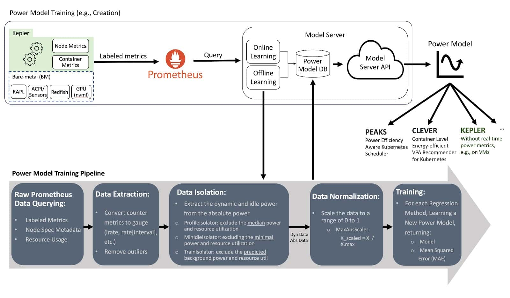

# Kepler Deep Dive

## Kepler Components and what they do

The Kepler stack comprises Kepler and Kepler Model Server

### Kepler

Kepler, Kubernetes-based Efficient Power Level Exporter, offers a way to estimate power consumption at the process, container, and Kubernetes pod levels. 

- How Kepler collects data?

Kepler uses the following to collects power data
1. EBPF: 
Kepler utilizes a BPF program integrated into the kernel’s pathway to extract process-related resource utilization metrics. 

2. Real-time Component Power Meters:
Kepler also collects real-time power consumption metrics from the node components using various APIs such as,
    - Intel Running Average Power Limit (RAPL) for CPU and DRAM power
    - NVIDIA Management Library (NVML) for GPU power

3. Platform Power Meters:
For platform power, i.e, the entire node power Kepler uses:
    - Advanced Configuration and Power Interface (ACPI)
    - Redfish/Intelligent Power Management Interface (IPMI)
    - Regression-based Trained Power Models when no real-time power metrics are available in the system. 

### Kepler Model Server

The Model Server is used to train power models, and it can be optionally deployed alongside Kepler to help Kepler select the most appropriate power model for a given environment. For example, considering the CPU model, available metrics and the required model accuracy. In the future, Kepler will also be able to select the power model with the same logic that the Model Server has. 

The Model Server trains its models using Prometheus metrics from a specific bare-metal node. It records how much energy the node consumed and the resource utilization of containers and system processes (OS and other background processes). The container metrics are obtained from running various small tests that stress different resources (CPU, memory, cache, etc.), like using a tool called stress-ng. When creating the power model, the Model Server uses a regression algorithm. It keeps training the model until it reaches an acceptable level of accuracy. 

Once trained, the Model Server makes these models accessible through a github repository, where any Kepler deployment can download the model from. Kepler then uses these models to calculate how much power a node (VM) consumes based on the way its resources are being used. The type of metrics used to build the model can differ based on the system’s environment. For example, it might use hardware counters, or metrics from tools like eBPF or cGroups, depending on what is available in the system that will use the model.

For details on the architecture follow the [documentation](https://sustainable-computing.io/kepler_model_server/architecture/) on Kepler Model Server.

### Collecting System Power Consumption – VMs versus BMs

Depending on the environment that Kepler was deployed in, the system power consumption metrics collection will vary. For example, consider the figure below, Kepler can be deployed either through BMs or VMs environments. 

Currently are three ways to collect system power consumption namely,

#### Direct Real-Time System Power Metrics (Bare Metals)

In bare-metal environments that allow the direct collection of real-time system power metrics, Kepler can split the power consumption of a given system resource using the Ratio Power model. But before explaining the Ratio Power model, we first need to introduce some concept related to the power metrics. The APIs that expose the real-time power metrics export the absolute power, which is the sum of the dynamic and idle power. To be more specific, the dynamic power is directly related to the resource utilization and the idle power is the constant power that does not vary regardless if the system is at rest or with load. This concept is important because the idle and dynamic power are splitted differently across all processes. 

#### Estimated System Power Metrics (Virtual Machines)

In VM environments on public clouds, there is currently no direct way to measure the power that a VM consumes. Therefore, we need to estimate the power using a trained power model, which has some limitations that impact the model accuracy. 

Kepler can estimate the dynamic power consumption of VMs using trained power models. Then, after estimating each VM’s power consumption, Kepler applies the Ratio Power Model to estimate the processes’ power consumption. However, since VMs usually do not provide hardware counters, Kepler uses eBPF metrics instead of hardware counters to calculate the ratios. It is important to highlight that trained power models used for VMs on a public cloud cannot split the idle power of a resource because we cannot know how many other VMs are running in the host. We provide more details in the limitation section in this blog. Therefore, Kepler does not expose the idle power of a container running on top of a VM.

Power models are trained by performing regression analysis (like Linear or Machine Learning (ML)-based regression) on data collected during benchmark tests. This data includes both resource utilization and power consumption on a Bare-metal node, forming the foundation for the power model estimation. 

#### Passthrough Estimated VM Power Metrics

Kepler is first deployed in the bare-metal node (i.e., the cloud control plane), and it continuously measures the dynamic and idle power that each VM consumes using real-time power metrics from the BM. Then, Kepler exposes this power data with the VM. This information can be made available to the VM through “hypervisor Hypercalls” [3] or by saving the numbers in special files that the VM can access (e.g., cGroup file mounted in the VM). Then, by using the VM power consumption, another Kepler instance within the VM can apply the Ratio Power Model to estimate the power used by processes residing in the VMs. 

>Note: The passthrough approach is still in exploratory and currently not available in Kepler. 

- [ ] Why these metric?
- [ ] How is the power consumption attribution done?
- [ ] Explain the [models](https://github.com/sustainable-computing-io/kepler-model-server/tree/main/tests/test_models). How the models are different and is there a right use case/scenario for when to apply a particular model over another?
    * [ ] AbsComponentModelWeight
    * [ ] AbsComponentPower
    * [ ] AbsModelWeight
    * [ ] AbsPower
    * [ ] DynComponentModelWeight
    * [ ] DynComponentPower
    * [ ] XGBoost

- [ ] Each model has three sub models BPFOnly, CgroupOnly, CounterOnly but we use only one of these models. Why is that?

